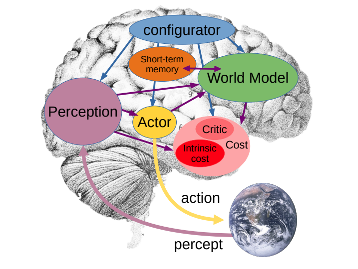

</img>

## JEPA - Pytorch (wip)

Implementation of <a href="https://openreview.net/forum?id=BZ5a1r-kVsf">JEPA (Joint Embedding Predictive
Architectures)</a>, Yann LeCun's vision of how AGI would be built, in Pytorch

<a href="https://www.youtube.com/watch?v=jSdHmImyUjk">Yannic Kilcher explanation</a>

## Citations

```bibtex
@inproceedings{lecun2022jepa,
    title   = {A Path Towards Autonomous Machine Intelligence},
    author  = {Yann LeCun},
    year    = {2022},
    url     = {https://openreview.net/forum?id=BZ5a1r-kVsf}
}
```
